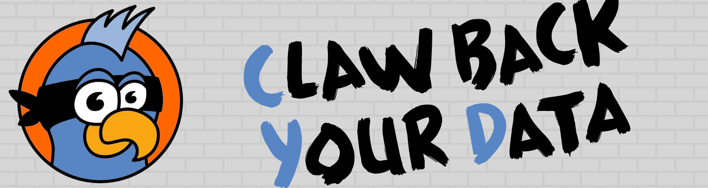
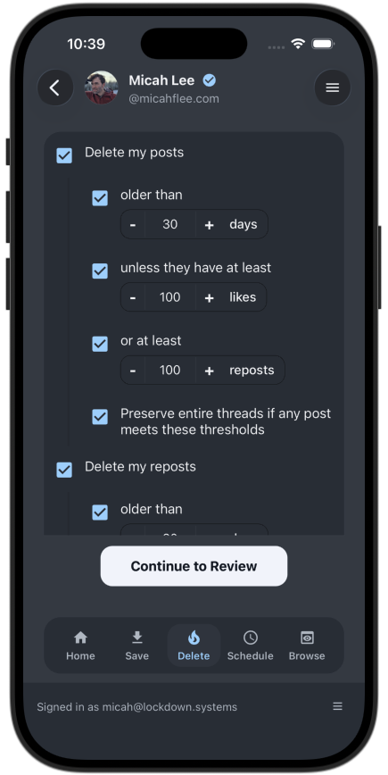

# Cyd Mobile: Claw back your data from Bluesky

Most tech platforms are controlled by a tiny group of powerful billionaires. You don't _owe_ them your data. Even posting to Bluesky is a privacy nightmare.

Cyd Mobile is the iPhone and Android version of [Cyd](https://cyd.social/), and it helps you to control your data in Bluesky.

With this app, you can:

- **Create a local, private backup of your data**, including Bluesky posts, reposts, likes, bookmarks, and chat messages.
- **Choose what you want to delete.** You can delete it all, or you can be selective, deleting most of it but keeping what went viral.
- **Schedule automatic deletion**, keeping your online data as ephemeral as you want over time.

**Want to claw back your data from X and Facebook?** [Cyd Desktop](https://github.com/lockdown-systems/cyd), for Windows, Mac, and Linux, helps you control your data on those platforms.

## Be patient

Cyd Mobile is under active development and testing. When it's ready, it will be available in the iPhone App Store and the Android Play Store.

## Documentation

Learn all about how to use Cyd, what features it has, and how to get involved in the open source project, including how to request features and report bugs, at the [Cyd Documentation](https://docs.cyd.social) website.
